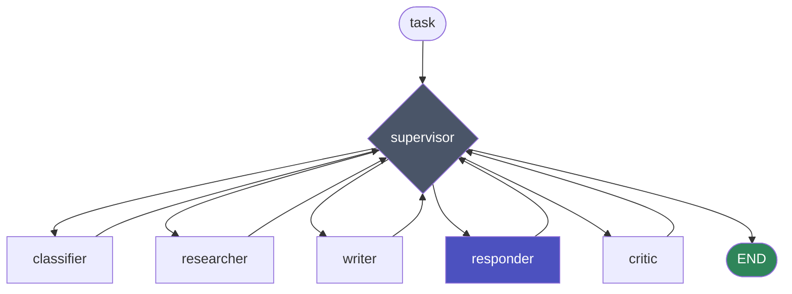

# Research-and-Report Agent System

A multi-agent research pipeline built on [LangGraph](https://langchain-ai.github.io/langgraph/) and the Claude API. Give it a question; it classifies the topic, searches the web, drafts a report, fact-checks that draft against its own research notes, and revises until the claims are grounded — with hard guardrails so it always terminates.

Then ask it follow-ups. Follow-ups answer from the notes behind the report you just got — no new search — and go through the same fact-checker the report did.

It remembers. Research notes are embedded with Voyage AI and stored behind a swappable backend, so later runs recall earlier ones and build on them instead of starting cold.

**Stack:** Python 3.10+ · LangGraph · Claude Sonnet 5 · Voyage AI embeddings · pytest

---

## Demo

```
$ python chat.py
Research agent  --  /help for commands, /exit to quit

task> What are the current approaches to LLM agent memory?
  ... classifying topic -> technical
  ... searching the web (recalled 2 note(s) from memory)
  ... drafting report
  ... fact-checking draft -> revision requested
  ... drafting report (revision 1)
  ... fact-checking draft -> approved

=== REPORT ===

# Current Approaches to LLM Agent Memory
...

  technical topic | 7 supervisor turns | 1/2 revisions | approved

task> /ask which of those handles multi-session recall?
  ... answering from prior notes
  ... fact-checking draft -> approved

=== ANSWER ===
...

  follow-up | 4 supervisor turns | 0/2 revisions | approved
```

The `revision requested` line is the system working as designed: the critic found a claim the research notes didn't support and sent the draft back.

The follow-up skipped the classifier and the researcher entirely — it already had the notes — but not the critic.

---

## Architecture

A **supervisor pattern**. Every worker node returns to a central supervisor, which inspects state and decides what happens next. Control flow is a deterministic function of state — not an LLM's choice.



Every worker returns to the supervisor, which re-reads state and picks the next hop. The routing table *is* `supervisor_node`, in order:

| Supervisor sees | Routes to |
|---|---|
| iteration or revision cap exceeded | END *(sets `forced_stop_reason`)* |
| follow-up with no prior notes | END *(sets `no_prior_research`)* |
| `topic_type` unset | classifier |
| no research notes | researcher |
| no draft | **author** |
| draft not yet reviewed | critic |
| critic returned `REVISE` | **author** *(revision)* |
| otherwise — approved | END |

**author** is the writer in research mode and the responder in follow-up mode. That substitution is the *only* thing `mode` changes — the caps, the critic hop, and the revision loop are byte-identical in both. A follow-up starts with `research_notes` and `topic_type` already populated, so the classifier and researcher rows simply never match.

| Node | Role |
|---|---|
| **supervisor** | Routes on state. Enforces iteration and revision caps. |
| **classifier** | Labels the task `technical`, `contested`, `sparse`, or `general`. Runs once. |
| **researcher** | Recalls related notes from the memory store, runs a web search, stores new findings. |
| **writer** | Drafts from research notes only. Re-drafts when the critic pushes back. |
| **responder** | Answers a follow-up from the prior run's notes and report. Never searches. |
| **critic** | Checks every claim against the notes. Returns `APPROVED` or `REVISE: <feedback>`. |

The classifier's label isn't cosmetic — it selects both the researcher's strategy and the critic's rubric:

| Topic type | Researcher does | Critic checks for |
|---|---|---|
| `technical` | Prioritize figures, versions, named sources | Numbers and dates absent from the notes |
| `contested` | Seek multiple viewpoints, note disagreement | Opinions presented as settled fact |
| `sparse` | Broaden search, flag coverage gaps | Overstated confidence where notes flagged a gap |
| `general` | Summarize well-supported facts | Any unsupported claim |

---

## Design decisions

The parts worth reading the code for.

**Routing is a state machine, not a prompt.** `supervisor_node` is plain Python — a chain of `if` statements over `AgentState`. No model call decides what runs next, so the control flow is deterministic, unit-testable, and identical on every run. The LLM does the work; the graph decides the order.

**The critic is a separate node with its own rubric.** Asking one model to draft and self-assess in a single call reliably produces "looks good to me." Splitting the draft and the grounding check into separate calls, with the critic given the research notes as the sole source of truth, catches ungrounded claims the writer introduced.

**Every loop is bounded, and stopping early is reported honestly.** `MAX_REVISIONS` caps the critic↔writer cycle; `MAX_ITERATIONS` caps total supervisor turns as a backstop against any unforeseen cycle. When a cap fires, `forced_stop_reason` propagates to the output so the user knows the report they're reading was never approved — a silent unapproved draft would be worse than no draft.

**Follow-ups reuse the critic instead of bypassing it.** The responder writes into the same `draft` field the writer does, so the critic grades a follow-up answer with the same rubric and the same revision loop — a follow-up can be sent back for revision exactly like a report. Asking a second question about a report you already have shouldn't mean re-searching the web, but it also shouldn't mean a lower standard of grounding. The responder is told that "the research didn't cover that" is a correct answer, and the critic is what makes that stick. A follow-up issued with no prior notes stops with `no_prior_research` rather than quietly answering from the model's own knowledge — the single failure mode this whole pipeline exists to prevent.

**Memory is real retrieval, not a growing prompt.** Notes are embedded with `voyage-3.5` and retrieved by cosine similarity with a relevance floor, so an unrelated past task doesn't leak into the current one. The researcher is explicitly told to prefer information not already covered, which turns memory into a coverage-expander rather than an echo.

**The store and the embedder are separate seams.** `MemoryStore` is an ABC — `add()`, `query()`, `len()`, `describe()` — with three implementations behind a `VECTOR_STORE` env var: JSON (default), in-memory, and Chroma. `Embedder` is a separate protocol, so switching stores never silently switches embedding models; that would invalidate every vector already written. Chroma keeps the same cosine ranking but adds an ANN index and stops loading the entire corpus into the agent process. A test asserts the graph never reaches past those four methods, so the seam can't rot.

**Retries happen at the node boundary, and are recorded.** A graph node is a whole unit of work, so retrying there means a transient 529 costs one repeated node rather than a failed run. `retry.py` retries only what can actually succeed on a second try — connection errors and 408/429/5xx — and raises straight through on 401 or 400, where waiting just burns wall-clock time. Backoff is exponential with equal jitter, and a server's `retry-after` wins when it asks for longer, because our curve is a guess and the header isn't. Every attempt lands in `state["trace"]`, so a slow run explains itself in `/trace` instead of looking like a stall. `sleep` and `rng` are injectable, which is why the retry tests run in milliseconds and assert exact delays.

**Nothing is constructed at import time.** Both API clients are built on first use. Eager construction would make the modules unimportable without a full set of keys — which would mean the routing table, the one genuinely deterministic part of the system, could not be tested at all. The whole suite runs with no keys and no network.


---

## Quickstart

```bash
git clone https://github.com/future-beat/research-agent.git
cd research-agent

python3 -m venv .venv
source .venv/bin/activate          # Windows: .venv\Scripts\activate
pip install -r requirements.txt

cp .env.example .env               # then add your two keys
```

You need two separate API keys:

- **`ANTHROPIC_API_KEY`** — [console.anthropic.com](https://console.anthropic.com/settings/keys)
- **`VOYAGE_API_KEY`** — [dashboard.voyageai.com](https://dashboard.voyageai.com/) (separate account; used only for embeddings)

`chat.py` loads `.env` automatically. If you'd rather export the variables yourself, that works too.

### Verify the setup

```bash
python vector_memory.py
```

Embeds two sentences, saves them, and retrieves one by similarity. If it prints a one-element list, your Voyage key and the memory layer are working.

---

## Usage

**Interactive (recommended):**

```bash
python chat.py
```

| Command | Does |
|---|---|
| *any text* | Run the full pipeline on that question |
| `/ask <q>` | Follow up on the last run using its notes — no new web search |
| `/memory` | How many notes are stored, and in which backend |
| `/trace` | Node-by-node trace of the last run |
| `/help` | Command list |
| `/exit` | Quit (Ctrl-D also works) |

`/ask` chains: each follow-up sees the earlier ones in the thread, and all of them stay anchored to the original report and its notes. Ask a new bare question and the thread resets.

Ctrl-C during a run cancels that run and returns you to the prompt. Transient API errors are retried with backoff inside each node; anything that survives that is caught per-turn, so a rate limit doesn't end the session.

**One-shot:**

```bash
python research_agent.py
```

Runs the single hardcoded task at the bottom of the file and prints the report plus the full trace.

---

## Tests

```bash
pip install -r requirements-dev.txt
pytest
```

95 tests, ~0.5s, no API keys and no network. The Claude client is stubbed and a fake embedder replaces Voyage, so what's under test is this system's own logic:

| File | Covers |
|---|---|
| `tests/test_supervisor_routing.py` | Every row of the routing table, in both modes; the caps; `route()`; and a check that no reachable decision lacks a graph edge |
| `tests/test_graph_smoke.py` | Full runs through the compiled graph — revision loops, the follow-up path, recall, guardrails |
| `tests/test_retry.py` | Which errors are retryable, backoff and jitter arithmetic, `retry-after`, budget exhaustion |
| `tests/test_memory_stores.py` | Both brute-force backends against one shared contract, persistence, the similarity floor, backend selection |

---

## Configuration

| Knob | Where | Default |
|---|---|---|
| `MAX_REVISIONS` | `research_agent.py` | `2` |
| `MAX_ITERATIONS` | `research_agent.py` | `8` |
| Model | `MODEL` in `research_agent.py` | `claude-sonnet-5` |
| Effort | per-node `output_config` | `medium` |
| Thinking | per-node `thinking` | `disabled` (classifier) / `adaptive` (rest) |
| `min_similarity` | `MemoryStore.query()` | `0.3` |

Set by environment variable:

| Variable | Does | Default |
|---|---|---|
| `VECTOR_STORE` | Backend: `json`, `memory`, or `chroma` | `json` |
| `VECTOR_STORE_PATH` | JSON store location | next to `vector_memory.py` |
| `CHROMA_PATH` / `CHROMA_COLLECTION` | Chroma location and collection | `chroma_store` / `research_notes` |
| `VOYAGE_EMBEDDING_MODEL` | Embedding model | `voyage-3.5` |
| `AGENT_MAX_ATTEMPTS` | Attempts per node, including the first | `4` |
| `AGENT_RETRY_BASE_DELAY` | Seconds before the first retry | `1.0` |
| `AGENT_RETRY_MAX_DELAY` | Ceiling on any single backoff sleep | `30.0` |

Switching backends does **not** migrate existing notes — each store owns its own data. `VECTOR_STORE=chroma` additionally needs `pip install chromadb`.

Research strategies and critic rubrics live in the `RESEARCH_STRATEGY` and `CRITIC_RUBRIC` dicts — add a topic type by adding a key to both.

---

## Project structure

```
research_agent.py       the graph: nodes, supervisor, routing, compile
vector_memory.py        Embedder + MemoryStore seams and the three backends
retry.py                retryable-error classification, backoff, node decorator
chat.py                 terminal REPL with streamed progress
tests/                  pytest suite (no keys, no network)
requirements.txt        pinned dependencies
requirements-dev.txt    + pytest
.env.example            key template
```

The default JSON store is written next to `vector_memory.py`, not to the working directory, so the same store is used no matter where you launch from.

---

## Limitations

Known, and deliberate for the scope:

- **Follow-ups can't reach for new information.** By design: the responder is confined to the notes it was given, so a follow-up needing a fresh search gets "the research didn't cover that" rather than an answer. Ask it as a new question instead. A `/dig` that routes a follow-up back through the researcher would close this.
- **The default backend still scans the whole store.** `JSONMemoryStore.query()` scores every note — O(n) per call, and it rewrites the entire file on every add. Correct at hundreds of notes, the wrong shape at thousands. That's what `VECTOR_STORE=chroma` is for; the JSON store stays the default because it needs no extra dependency.
- **The critic shares the writer's model.** Independent enough to catch ungrounded claims, but not a genuinely independent evaluator.
- **The store grows without bound.** No eviction, no deduplication, no summarization.
- **Conversation state is per-process.** `/ask` threads live in the REPL's memory and vanish on exit. Durable multi-turn sessions would want a real session store rather than a local variable.
- **Retries assume nodes are safe to re-run.** They are today — each node overwrites its own fields — but a node that appended to state instead of replacing it would double-write on retry.

Natural next steps: an HTTP surface over `initial_state` / `followup_state` with durable sessions, per-run cost accounting, an evaluation harness, and containerized deployment.

---

## License

MIT — see [LICENSE](LICENSE).
