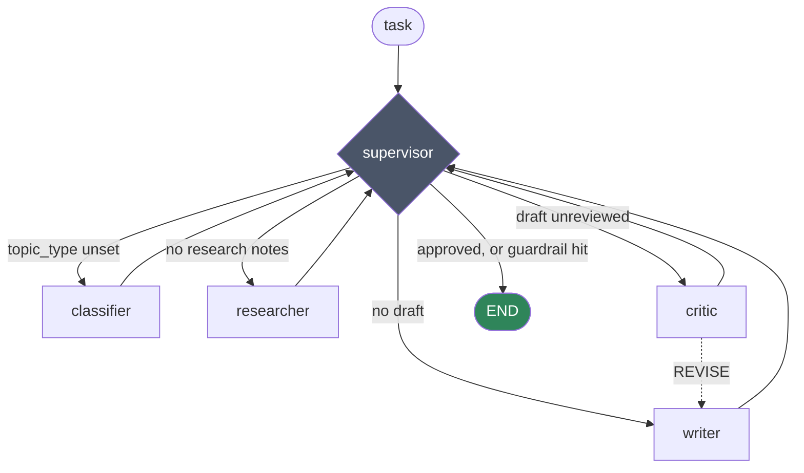

# Research-and-Report Agent System

A multi-agent research pipeline built on [LangGraph](https://langchain-ai.github.io/langgraph/) and the Claude API. Give it a question; it classifies the topic, searches the web, drafts a report, fact-checks that draft against its own research notes, and revises until the claims are grounded — with hard guardrails so it always terminates.

It remembers. Research notes are embedded with Voyage AI and persisted to disk, so later runs recall earlier ones and build on them instead of starting cold.

**Stack:** Python 3.10+ · LangGraph · Claude Sonnet 5 · Voyage AI embeddings

---

## Demo

```
$ python chat.py
Research agent  --  /help for commands, /exit to quit

task> What are the current approaches to LLM agent memory?
  ... classifying topic -> technical
  ... searching the web (recalled 2 note(s) from memory)
  ... drafting report
  ... fact-checking draft -> revision requested
  ... drafting report (revision 1)
  ... fact-checking draft -> approved

=== REPORT ===

# Current Approaches to LLM Agent Memory
...

  technical topic | 7 supervisor turns | 1/2 revisions | approved
```

The `revision requested` line is the system working as designed: the critic found a claim the research notes didn't support and sent the draft back.

---

## Architecture

A **supervisor pattern**. Every worker node returns to a central supervisor, which inspects state and decides what happens next. Control flow is a deterministic function of state — not an LLM's choice.



| Node | Role |
|---|---|
| **supervisor** | Routes on state. Enforces iteration and revision caps. |
| **classifier** | Labels the task `technical`, `contested`, `sparse`, or `general`. Runs once. |
| **researcher** | Recalls related notes from vector memory, runs a web search, stores new findings. |
| **writer** | Drafts from research notes only. Re-drafts when the critic pushes back. |
| **critic** | Checks every claim against the notes. Returns `APPROVED` or `REVISE: <feedback>`. |

The classifier's label isn't cosmetic — it selects both the researcher's strategy and the critic's rubric:

| Topic type | Researcher does | Critic checks for |
|---|---|---|
| `technical` | Prioritize figures, versions, named sources | Numbers and dates absent from the notes |
| `contested` | Seek multiple viewpoints, note disagreement | Opinions presented as settled fact |
| `sparse` | Broaden search, flag coverage gaps | Overstated confidence where notes flagged a gap |
| `general` | Summarize well-supported facts | Any unsupported claim |

---

## Design decisions

The parts worth reading the code for.

**Routing is a state machine, not a prompt.** `supervisor_node` is plain Python — a chain of `if` statements over `AgentState`. No model call decides what runs next, so the control flow is deterministic, unit-testable, and identical on every run. The LLM does the work; the graph decides the order.

**The critic is a separate node with its own rubric.** Asking one model to draft and self-assess in a single call reliably produces "looks good to me." Splitting the draft and the grounding check into separate calls, with the critic given the research notes as the sole source of truth, catches ungrounded claims the writer introduced.

**Every loop is bounded, and stopping early is reported honestly.** `MAX_REVISIONS` caps the critic↔writer cycle; `MAX_ITERATIONS` caps total supervisor turns as a backstop against any unforeseen cycle. When a cap fires, `forced_stop_reason` propagates to the output so the user knows the report they're reading was never approved — a silent unapproved draft would be worse than no draft.

**Memory is real retrieval, not a growing prompt.** Notes are embedded with `voyage-3.5` and retrieved by cosine similarity with a relevance floor, so an unrelated past task doesn't leak into the current one. The researcher is explicitly told to prefer information not already covered, which turns memory into a coverage-expander rather than an echo. The file-backed store is deliberately swappable — `add()` / `query()` is the whole interface, so a real vector DB drops in without touching the graph.

**Inference settings are tuned per node, not globally.** The classifier emits one word from a fixed set, so it runs with thinking disabled and `effort: "low"` under a 20-token ceiling. The researcher, writer, and critic do genuine reasoning and run with adaptive thinking at `effort: "medium"`. Uniform settings would either overpay for the classifier or starve the critic.

**Every run is traceable.** Each node appends to `state["trace"]`, giving a full record of routing decisions, recall counts, draft lengths, and critic verdicts. Inspect it with `/trace` in the REPL.

---

## Quickstart

```bash
git clone <your-repo-url>
cd research-and-report-agent-system

python3 -m venv .venv
source .venv/bin/activate          # Windows: .venv\Scripts\activate
pip install -r requirements.txt

cp .env.example .env               # then add your two keys
```

You need two separate API keys:

- **`ANTHROPIC_API_KEY`** — [console.anthropic.com](https://console.anthropic.com/settings/keys)
- **`VOYAGE_API_KEY`** — [dashboard.voyageai.com](https://dashboard.voyageai.com/) (separate account; used only for embeddings)

`chat.py` loads `.env` automatically. If you'd rather export the variables yourself, that works too.

### Verify the setup

```bash
python vector_memory.py
```

Embeds two sentences, saves them, and retrieves one by similarity. If it prints a one-element list, your Voyage key and the memory layer are working.

---

## Usage

**Interactive (recommended):**

```bash
python chat.py
```

| Command | Does |
|---|---|
| *any text* | Run the full pipeline on that question |
| `/memory` | How many notes are in the store |
| `/trace` | Node-by-node trace of the last run |
| `/help` | Command list |
| `/exit` | Quit (Ctrl-D also works) |

Ctrl-C during a run cancels that run and returns you to the prompt. API errors are caught per-turn, so a rate limit doesn't end the session.

**One-shot:**

```bash
python capstone_research_agent.py
```

Runs the single hardcoded task at the bottom of the file and prints the report plus the full trace.

---

## Configuration

| Knob | Where | Default |
|---|---|---|
| `MAX_REVISIONS` | `capstone_research_agent.py` | `2` |
| `MAX_ITERATIONS` | `capstone_research_agent.py` | `8` |
| Model | per-node `model=` | `claude-sonnet-5` |
| Effort | per-node `output_config` | `low` (classifier) / `medium` (rest) |
| `EMBEDDING_MODEL` | `vector_memory.py` | `voyage-3.5` |
| `min_similarity` | `VectorMemory.query()` | `0.3` |

Research strategies and critic rubrics live in the `RESEARCH_STRATEGY` and `CRITIC_RUBRIC` dicts — add a topic type by adding a key to both.

---

## Project structure

```
capstone_research_agent.py   the graph: nodes, supervisor, routing, compile
vector_memory.py             embedding-backed persistent memory (add / query)
chat.py                      terminal REPL with streamed progress
requirements.txt             pinned dependencies
.env.example                 key template
```

The memory store is written next to `vector_memory.py`, not to the working directory, so the same store is used no matter where you launch from.

---

## Limitations

Known, and deliberate for the scope:

- **One-shot per task.** Each turn is an independent pipeline run. You can't ask a follow-up about the report you just got — continuity comes only through vector recall.
- **Linear similarity scan.** `query()` compares against every stored note. Fine at hundreds of entries; swap in a real vector DB before it's thousands.
- **The critic shares the writer's model.** Independent enough to catch ungrounded claims, but not a genuinely independent evaluator.
- **The store grows without bound.** No eviction, no deduplication, no summarization.
- **No test suite.** The graph is deterministic and the nodes are pure functions of state, so it's very testable — there just aren't tests yet.

Natural next steps: conversational follow-ups over the last run's notes, a swappable vector-store backend, per-node retry with backoff, and unit tests over the supervisor's routing table.

---

## License

MIT — see [LICENSE](LICENSE).
